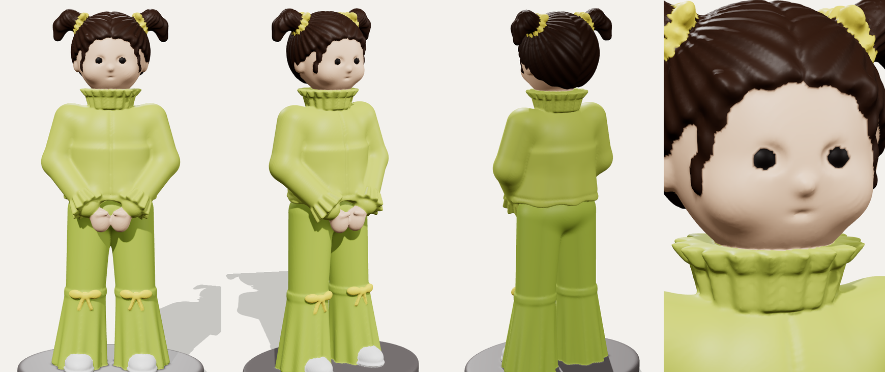

# 3D-printable figurine: little girl in a green outfit



This is a stylised figurine of a toddler, modelled on a reference photo. It copies her outfit and pose: two small pigtails with yellow bows, a high ruffled collar, a shiny long-sleeve jacket with ruffled cuffs, hands clasped in front, flared trousers with a bow on each knee, and sneakers. She stands on an oval base.

| File | What it is |
|---|---|
| `girl_figurine.stl` | One-piece model for single-colour printing. It is 106 mm tall and 54 × 45 mm at the base, watertight, and one solid body. |
| `multicolor/1_skin.stl` … `8_base.stl` | The same model split into 8 non-overlapping parts for multi-colour printers (AMS, MMU and similar). |
| `girl_figurine_color.glb` | Coloured preview. Open it in any glTF viewer, Windows 3D Viewer or Blender. |
| `figurine.py` | The generator script that builds all of the files above. |
| `lithophane.py` | Turns any photo into a standing lithophane, which shows the photo when lit from behind. |

## Printing the figurine

**FDM (PLA, 0.4 mm nozzle)**
- Layer height: 0.12 mm. The face and ruffles benefit from fine layers. 0.16 mm also works.
- Supports: use tree/organic supports, touching the build plate only if possible. The arms, hands, chin, pigtails and jacket hem overhang.
- Infill: 10–15 %, with 3 walls.
- No brim is needed because the base is wide and flat.
- Scale: print at 100 % or larger. Below about 80 mm tall the face gets soft. For a small, highly detailed print, use a resin printer.

**Multi-colour**
1. Select all 8 files in `multicolor/` and drag them into Bambu Studio, Orca Slicer or PrusaSlicer together.
2. When asked, answer **Yes** to "load as a single object with multiple parts".
3. Assign the filaments. Suggested colours:

| Part | Colour |
|---|---|
| skin | light beige |
| eyes | black |
| hair | dark brown |
| ribbons | yellow |
| jacket and pants | yellow-green |
| shoes | white |
| base | grey or any colour |

**Painting:** print `girl_figurine.stl` in white or grey, prime it, and paint it using the preview as a guide.

## Changing the model

```bash
pip install numpy scipy scikit-image trimesh fast-simplification manifold3d opencv-python-headless
python figurine.py                 # rebuild everything at 0.25 mm detail (about 1–2 minutes)
python figurine.py --height 150    # make it 150 mm tall
python figurine.py --res 0.5       # quick low-detail draft
```

The whole figure is built from simple shapes in `figurine.py`, such as `hair()`, `jacket()` and `pants()`. The coordinates are in millimetres, with Z pointing up and the figure facing -Y. To change part of the model (longer hair, a different collar, bigger eyes and so on), edit the matching function and run the script again.

## Photo lithophane

```bash
python lithophane.py photo.jpg -o photo_lithophane.stl --height 120
```

This produces a framed plate with a foot. Print it standing upright in white PLA, with 100 % infill and 0.12 mm layers, then put a light behind it.

> Note: this repository is public. Lithophanes and photos are listed in `.gitignore` so that personal pictures are not committed by accident.
